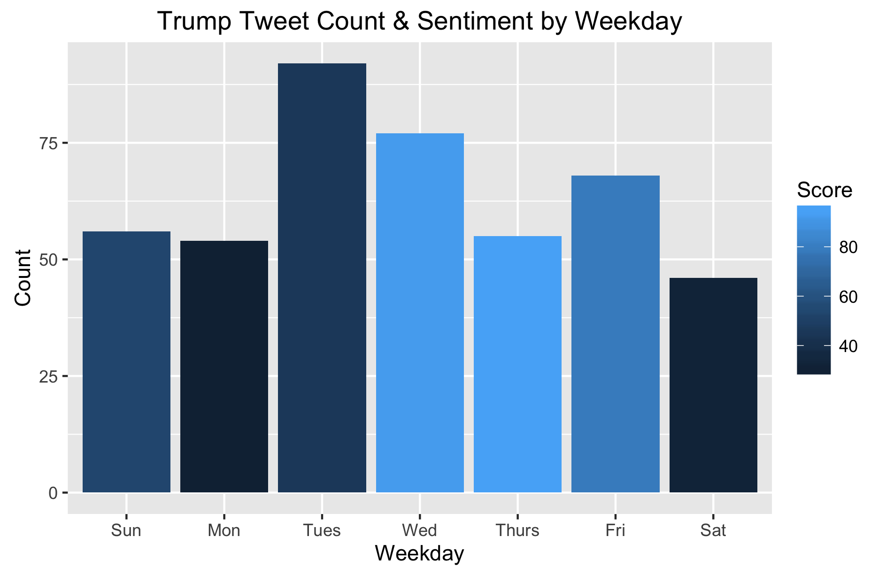
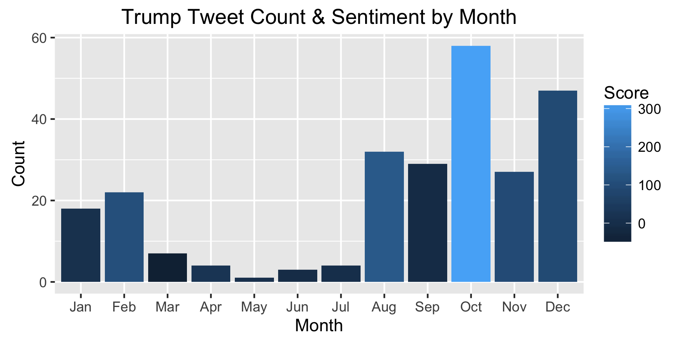
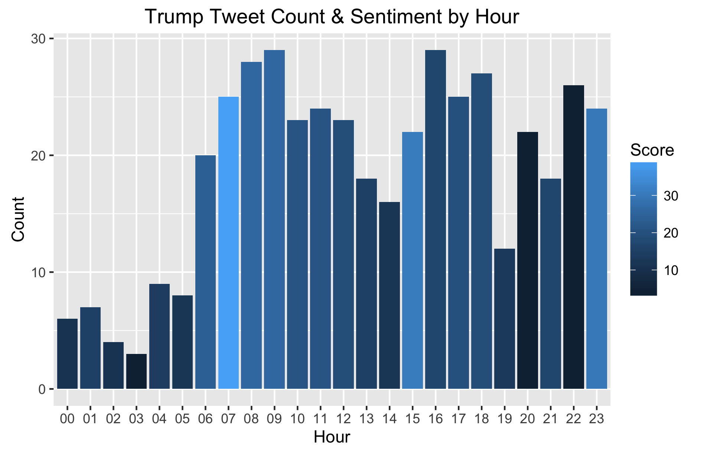

# tidy trump
### Trump Doesn't Like Mondays

Playing with fivethirtyeight trump tweet data to learn more about tidytext capabilities (and just to have some fun)

### findings
 * Not unlike Garfield, Trump doesn't seem to like Mondays (or Saturdays).  The sentiment of Trump's tweets on Mondays and Saturdays appears to be the most negative
 * trump had a good October in 2015.  Not only did he tweet the most in 10/2015 but he also had the most positive sentiment in the month. (plan to look more into cause of positivity)

### data
    data(trump_twitter, package = "fivethirtyeight")

### libraries used
    library(tidytext)
    library(SnowballC)
    library(tidyverse)
    library(stringr)
    library(fivethirtyeight)
    library(lubridate)
    library(gridExtra)

### most positive/negative tweets
#### top 3 positive
 * Wow, every poll said I won the debate last night. Great honor!

 * Just found out I won the Rockingham County Republican Booth Straw Poll at the Deerfield Fair in New Hampshire this past weekend. 39% ---Wow!

 * .@JebBush has spent  $63,000,000 and is at the bottom of the polls. I have spent almost nothing and am at the top. WIN!  @hughhewitt 

#### top 3 negative
  * Marco Rubio is a member of the Gang Of Eight or, very weak on stopping illegal immigration. Only changed when poll numbers crashed.

  * Why would anyone in Kentucky listen to failed presidential candidate Rand Paul re: caucus. Made a fool of himself (1%.) KY his 2nd choice!

  * Yet another weak hit by a candidate with a failing campaign. Will Jeb sink as low in the polls as the others who have gone after me?

### ggplot2 results 
##### (score represents sentiment using `tidytext::get_sentiments("afinn")`)
#### What day of week does trump tweet the most?  Is sentiment more positive on certain days?

#### What month does trump tweet the most?  Is sentiment more positive in certain months?

#### What time of day does trump tweet the most?  Is sentiment more positive at certain times?

