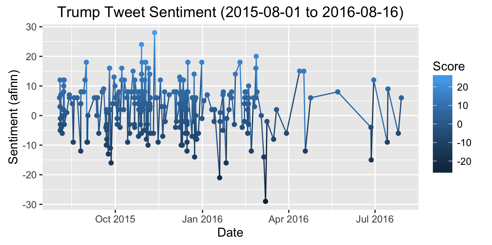
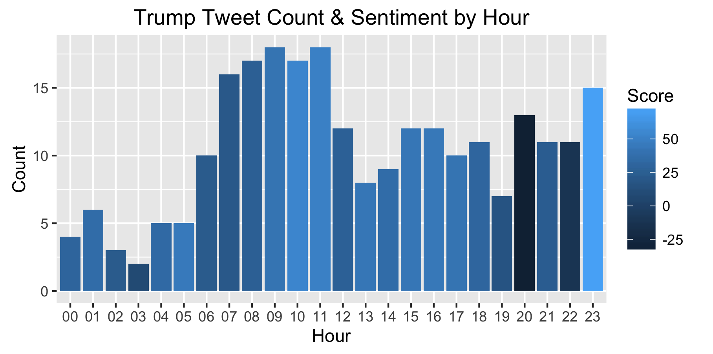
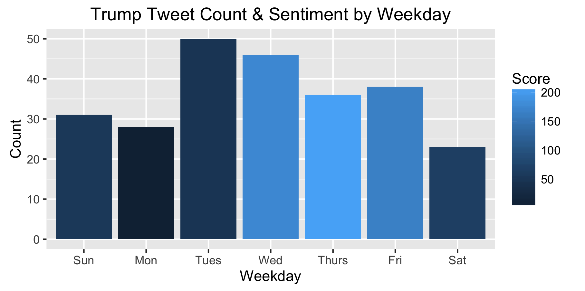

# tidy trump

Playing with fivethirtyeight trump tweet data to learn more about tidytext capabilities (and just to have some fun)

### data
    data(trump_twitter, package = "fivethirtyeight")

### libraries used
    library(tidytext)
    library(SnowballC)
    library(tidyverse)
    library(stringr)
    library(fivethirtyeight)
    library(lubridate)
    library(gridExtra)

### ggplot2 results
#### How does trump's sentiment change over time?

#### What time of day does trump tweet the most?  Is sentiment more positive at certain times?

#### What day of week does trump tweet the most?  Is sentiment more positive on certain days?

#### What month does trump tweet the most?  Is sentiment more positive in certain months?

